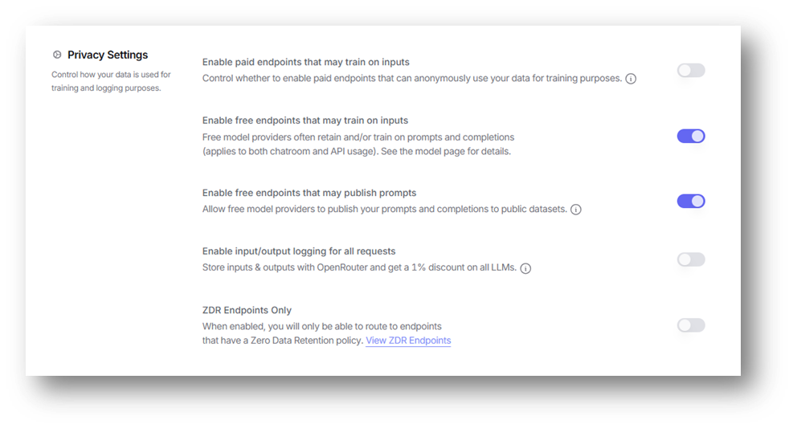
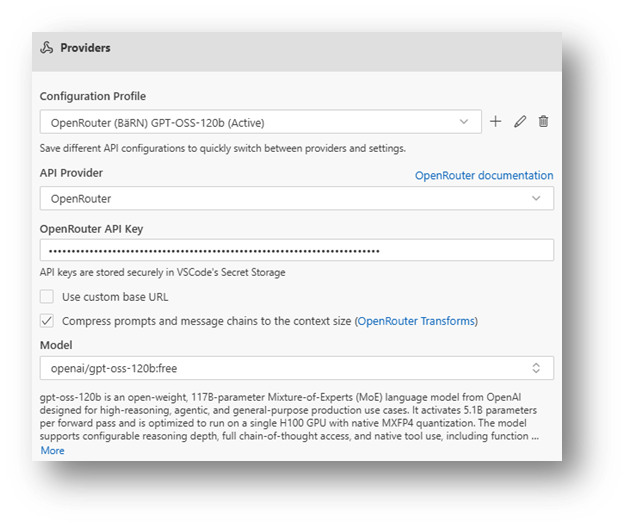
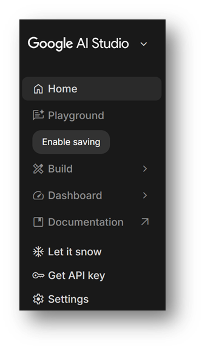
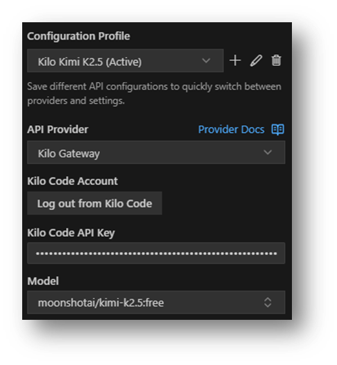

# Context Engeineering v2

**Anforderungen und Lösung endlich auf einer Linie**

Daniel Frey, Beat Hildebrand, Adrian Thürig

## Inhalt 90’

- 20’ Agenda, Begrüssung, Wissensaufbau, Gruppen
- 50’ Working Sessions
- 20’ Präsentation der Resultate, Fragen & Abschluss

## Kurze Umfrage

- Wer benutzt KI für das tägliche **Requirements Engineering**?
- Wer hat eine Entwicklungsumgebung (IDE) wie **Visual Studio Code** (oder einen Klon wie **Cursor** oder **Windsurf**) NICHT installiert?
- Wer nutzt ein **Plugin** für die Verarbeitung der Prompts in der IDE? (Bsp. **Kilo Code**, Cline, Roo Code, Augment Code)?

# Wissensaufbau

## Begriffe im heutigen Workshop

- IDE: Integrierte Entwicklungsumgebung
- Plugin: Erweiterung für eine DIE
- LLM: Large Language Model (ein KI-Modell)
- Prompt: Anweisung an ein LLM
- Kontext: Nebst dem Prompt mitgegebene Daten und Informationen
- Token: Wort oder Wortfragment
- Chat: Eingabefenster für die Interaktion mit dem LLM

## Vereinfachte Übersicht Engineering Use Cases

## KI & Kontext

- Kontext ist der «Arbeitsraum» der KI: Was nicht drin ist, wird aus dem gelernten allgemeinen Wissen bezogen.
- Ziel: Kontext bewusst formen statt zufällig entstehen lassen.
- Takeaway: Kontextqualität schlägt Kontextmenge.

**Speakernotes**

- «Arbeitsraum» heisst: Prompt + Systemregeln + ausgewählte Quellen. Fehlt etwas im Kontext, greift das Modell auf sein allgemeines Trainingswissen zurück, das je nach Modell sehr unterschiedlich gross bzw. spezialisiert sein kann.
- Kontext formen bedeutet: Quellen definieren (z.B. Repo, Spec, Tickets), Umfang begrenzen und einen klaren Einstiegspunkt bieten.
- Qualität schlägt Menge: 3 relevante Dokumente mit aktueller Version schlagen 30 veraltete PDFs.

## Begrenzung des Kontextfensters

- Fenster hat Kapazität: Relevanz priorisieren.
- Zonen: Blind Zone (zu wenig), Smart Zone (kuratierter Kern), Dumb Zone (überladen).
- Praxis: «Was ist heute entscheidungsrelevant?»
- Quelle: [Dex Horthy, &#34;No Vibes Allowed: Solving Hard Problems in Complex Codebases&#34; (YouTube, 2024)](https://www.youtube.com/watch?v=rmvDxxNubIg)

**Speakernotes**

- Modelle haben harte Token-Grenzen: zu viel Kontext verdrängt das Wichtige («Attention dilution»).
- Blind Zone: zu wenig Kontext → Modell greift auf allgemeines Wissen zurück und rät. Typisch, wenn Specs fehlen.
- Smart Zone: komprimierter Kern (Ziele, Constraints, relevante Files/Abschnitte) → beste Präzision.
- Dumb Zone: überfülltes Fenster → Leistung sinkt; je nach Modell kann die Degradation bereits bei ca. ~40% Auslastung beginnen.
- Referenz: [Dex Horthy, &#34;No Vibes Allowed: Solving Hard Problems in Complex Codebases&#34; (YouTube, 2024)](https://www.youtube.com/watch?v=rmvDxxNubIg), Dumb Zone ~40% Context Window ([5:55](https://www.youtube.com/watch?v=rmvDxxNubIg&t=355s)), Smart Zone ([18:45](https://www.youtube.com/watch?v=rmvDxxNubIg&t=1125s))
- Entscheidungsrelevant ist alles, was die aktuelle Aufgabe beeinflusst (z.B. Definition of Done, Datenmodell, kritische Constraints).

## Kontextmanagement-Strategien

Wie finden wir (Mensch und AI) die relevanten Quellen?

- Manuelles, explizites **Zitieren** von Quellen (typischerweise mit @-Notation).
- Manuell oder automatisch erstellte Rules, **Memory**.
- Automatisiertes **Suchen** nach relevanten Quellen (z.B. grep).
- Automatische gezielte Abfrage über Model Context Protocol (**MCP**).
- Automatische semantische Suche über Retrieval Augmented Generation (**RAG**).

## RAG als Prinzip

- **RAG** = Retrieval Augmented Generation.
- **Semantische Suche** zur gezielten Kontextversorgung zur Laufzeit.
- Verschiedene Ansätze: Versteckt (Tools integriert) vs. explizit (sichtbar gesteuert).
- Nutzen: aktuellere Antworten, weniger Halluzinationen.

**Speakernotes**

- RAG koppelt Modellantworten an externe Quellen; Retrieval bestimmt, was ins Kontextfenster gelangt.
- Versteckt: Agent-Tools ziehen Kontext ohne dass der User es steuert. Explizit: User definiert Quelle und Suchkriterien.
- Aktualität ist der grosse Gewinn: statt Trainingswissen wird Live-Wissen genutzt (z.B. letzter Commit, aktuelle Spec).

## Suche als Alternative

- Retrieval ohne Embeddings: schnell, transparent, prüfbar.
- Gut für: klare Schlüsselwörter, feste Begriffe, technische Logs.
- In IDEs: auch deterministisch verfügbar und kombinierbar.

**Speakernotes**

- Klassische Suche ist nachvollziehbar: Trefferlisten sind erklärbar und debugbar.
- Keywords funktionieren besonders gut für Konstanten, IDs, API-Namen oder Fehlermeldungen.
- Search-First: erst Trefferliste, dann gezielt RAG auf die Top-Quellen.

## MCP Server & Alternativen

- **MCP** = Model Context Protocol.
- Standardisierter Zugriff auf externe Wissensquellen (Lesend).
- Outputs direkt in MD/Confluence/Jira → Artefakte bleiben synchron (Schreibend).

**Speakernotes**

- MCP macht Tools austauschbar: Quelle wird zu einem standardisierten «Adapter».
- Direkter Output reduziert Medienbrüche: Spec, Ticket und Code bleiben konsistent, weil die KI in die Zielsysteme schreibt.
- Sicherheit: Tokens scoped vergeben, Zugriffe protokollieren, und nur freigegebene Räume anbinden.

## Memory

- **Kurzfristiger Speicher** für langlebige Projektannahmen.
- Nur das behalten, was **zwischen Sessions** stabil bleibt.
- Auf **verschiedenen Ebenen** anwendbar: Projekt, User, Global
- Pflege nötig: veraltete Memories aktiv entfernen.

**Speakernotes**

- Memory ist kein Langzeitarchiv, sondern ein Set stabiler Annahmen (z.B. Architekturprinzipien, Datenquellen).
- Auswahlkriterium: Was brauche ich in 2 Wochen noch zuverlässig?
- Hygiene: veraltete Annahmen löschen, sonst wird das Modell falsch «vorgeprägt».

# Setup

## Generelle Installation

Generelle Installation der Workshop Unterlagen:

- GitHub Repo in ein Verzeichnis der Wahl klonen: `git clone https://github.com/danielfrey63/bern-requirements-night.git`
- VS Code starten und das Verzeichnis `bern-requirements-night` öffnen.

## Freie LLM Provider – OpenRouter / Kilo Code

- Konto bei [OpenRouter](https://openrouter.ai/) anlegen.
- API Key erstellen.
- In den [Privacy Settings](https://openrouter.ai/settings/privacy) «Enable free endpoints that may train on inputs» und «Enable free endpoints that may publish prompts» ermöglichen.
- Konfiguration für Kilo Code Plugin anpassen. Modell-Filter «free».

| Privacy Settings für OpenRouter              | Konfiguration von Kilo Code Plugin               |
| --------------------------------------------- | ------------------------------------------------ |
|  |  |

## Freie LLM Provider – Google Gemini / Kilo Code

- Konto bei [Google AI Studio](https://aistudio.google.com/) anlegen.
- Ein [API Key](https://aistudio.google.com/api-keys) wird automatisch erstellt (Screenshot rechts).
- Konfiguration für Kilo Code Plugin anpassen. Modell-Filter «free».

| Google AI Studio API Key                        | Konfiguration von Kilo Code Plugin               |
| ----------------------------------------------- | ------------------------------------------------ |
|  |  |

## Freie LLM Provider – Google Gemini / Kilo Code

- Das [VS-Code Plugin für Kilo Code](https://kilo.ai/install) muss installiert sein.
- Ein Konto bei [Kilo Code](https://app.kilo.ai/users/sign_in) anlegen und eingeloggt sein.
- [Konfiguration für Kilo Code Plugin](https://kilo.ai/docs/features/api-configuration-profiles) anpassen auf API Provider Kilo Gateway und Modell moonshotai/kimi-k2.5:free.

## Installation RAG

- GitHub Repo klonen: `git clone https://github.com/danielfrey63/bern-requirements-night.git`
- Auf Terminal: `cd bern-requirements-night`
- Auf MacOS und Linux:
  - Eingeben: `chmod +x ./decrypt.sh`
  - Eingeben: `./decrypt.sh ./secrets.zip.aes ./zugaenge.zip`
- Auf Windows PowerShell:
  - Eingeben: `./decrypt.ps1 ./secrets.zip.aes ./zugaenge.zip`
